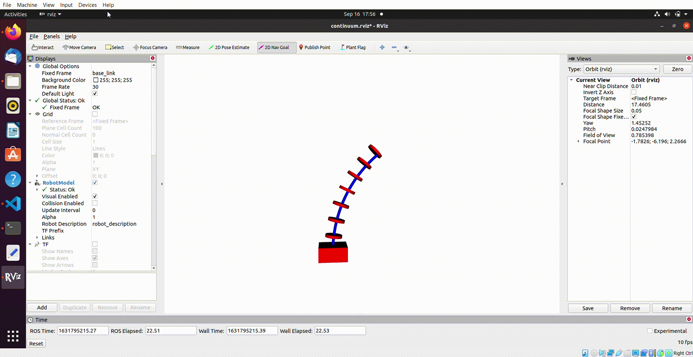
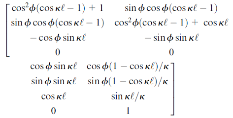

# RVIZ visualization of a tendon driven continuum robot

In the given project, a tendon driven continuum robot is developed by using floating joints. The Piecewise constant curvature method is used to model the compliant nature of continuum robot. 

------

### Single Section Robot Demo

<p align="left">

</p>

------

## Project Workflow 

The ROS workflow used for the project is shown in the below figure - 

<p align="left">

</p>

* **PublishEE** - Publisher Node and publish End Effector Coordinates

* **Cr_Model** - Subscriber Node and calls Continuum Class once it receives End Effector Coordinates

* **Continuum** - Most Crucial file in the package. Following tasks are performed -
  * URDF File created given number of links and robot length.
  * Coordinate and Rotation of intermediate links calculated and broadcasted using TransformBroadcaster

------

## Continuum Robot Model

For the given analysis, a Piecewise Constant curvature method proposed by <a href="https://ieeexplore.ieee.org/document/1588999" target="_blank">I.D. Walker</a>is used. PCC method approximates the continuum robot as a series of substitutions applied to a modified homogenous transformation matrix computed using a D-H-type approach. This formulation also relies on the assumption that the trunk bends with constant curvature, due to the compliance of the trunk. The rotation matrix calculated using the above process is given by -

<p align="center">

</p>

------

## Running the Simulation

to the run the following package in 3 seperate terminals run -

```python
roscore
```


```python
rosrun continuum_rb cr_model
```


```python
roslaunch continuum_rb rviz.launch

------

```
## Contact

If you have any questions, please let me know:

- Shaswat Garg {[sis_shaswat@outlook.com]()}

--------
